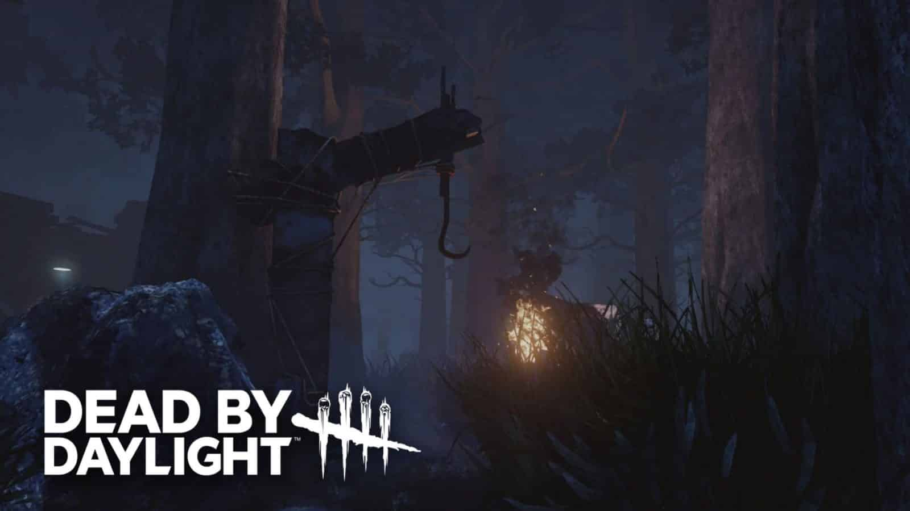

# Dead by daylight quiz

This quiz is for fun and entertainment, by asking question that is related to the game lore and fact.

[Link to deployed site]

## Feature

### Logo

Logo of the quiyz with similar color and font from originial game. It is also function as home page anchor.

#### Hero image

Background hero image featuring one of the iconic feature in game with dark tone and the scary atmosphere.

#### Index

Aside featuring the logo of the quiz, there is the start button to start the quiz.

#### Game

The game feature ten question that depending on the number of answers will give the user with message.

After answering all question, depending on the amount of the answer that is correct a message will pop-up.

#### UX

The quiz will be focusing only on the lore of dead by daylight, with many contraversial change in the gameplay mechanic, it is amusing to just diving into the lore and the fact instead of gameplay.

The font I use for the logo is Lato, whihc is similar to the original logo as can be seen below:

For the text in the quiz, I use Roboto for easy read and the simply look it has.

The wireframes for the index and game section as can be seen below:

## Future update and plan

Add more questions in the near future.

Add question with images.

Changing score system.

## Testing

Testing HTML through W3C Validator and CSS using Jigsaw, screenshot of proof can be seen below:

Index:

Game:

CSS:

Javascript:

-There are 10 functions in this file.

-Function with the largest signature take 1 arguments, while the median is 0.

-Largest function has 8 statements in it, while the median is 5.

-The most complex function has a cyclomatic complexity value of 2 while the median is 2.

## Credit

Based idea:

https://www.youtube.com/watch?v=PBcqGxrr9g8&t=1004s

Loop:

https://www.tutorialspoint.com/javascript/javascript_for_loop.htm

Hero image:

https://wallpapercave.com/dead-by-daylight-wallpapers

resetState:

https://stackoverflow.com/questions/75571616/quiz-in-javascript

Docstrings:

https://dev.to/stephencweiss/write-your-own-javascript-contracts-and-docstrings-42ho

Favicon:

https://www.cleanpng.com/free/dead-by-daylight.html